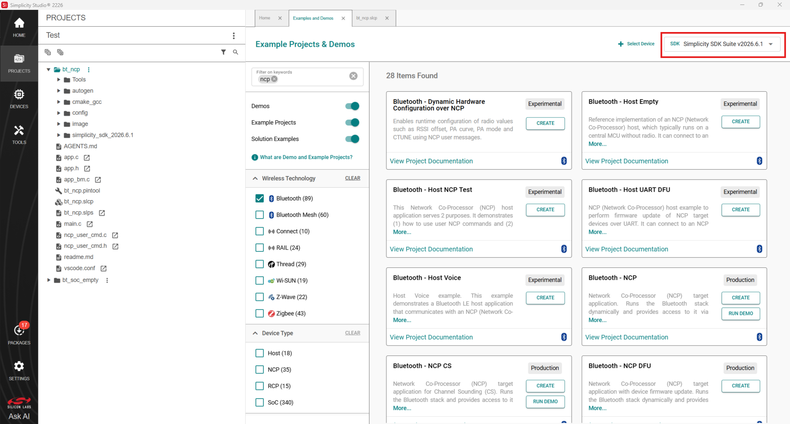
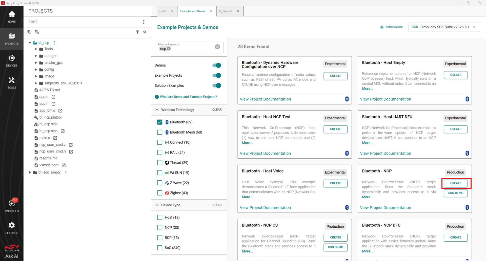
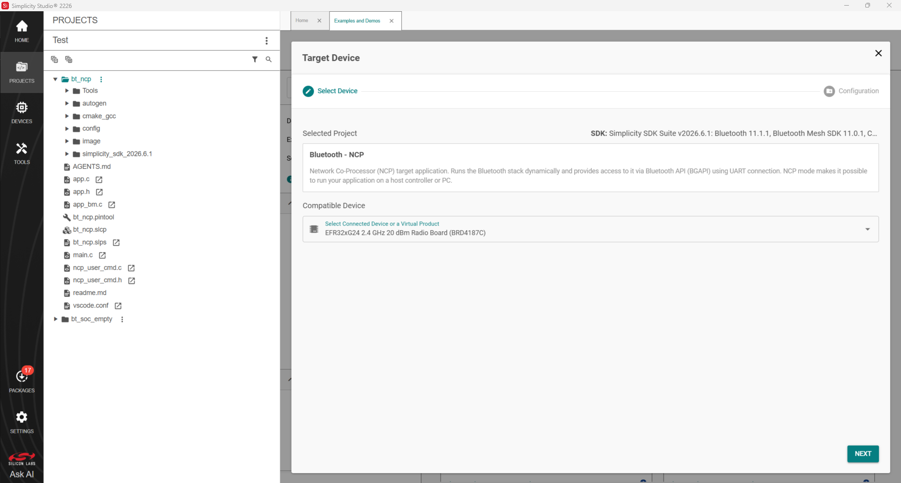
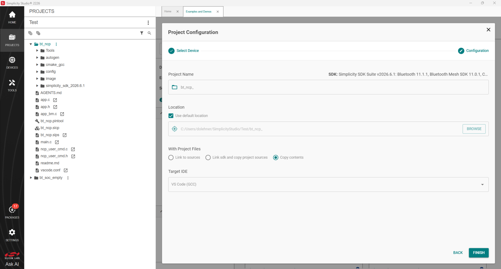

# NCP Target Development

This page describes the available tools for compiling and flashing the NCP target firmware.

Before you compile and flash C-based firmware, install Simplicity Studio 6 (SSv6). Download it from the [Silicon Labs website](http://www.silabs.com/simplicity). After you install Simplicity Studio, follow the prompts to install the Simplicity SDK Suite (SiSDK). For information about installing and using Simplicity Studio, see the [Simplicity Studio 6 User's Guide](https://docs.silabs.com/ssv6ug/latest/ssv6ug-overview/). For more information about Bluetooth, see the [Bluetooth Getting Started Guide](https://docs.silabs.com/bluetooth/latest/bluetooth-getting-started-overview/).

>**Note**: [Using the Silicon Labs Bluetooth Stack v3.x and Higher in Network Co-Processor Mode](https://docs.silabs.com/bluetooth/latest/bluetooth-network-coprocessor-mode/) describes in detail how the NCP is implemented in the Gecko SDK v2. This application note explains the code and tools on both the target and host side.

To develop in C, you not only need Simplicity Studio 6 but also a supported compiler. The Bluetooth SDK release notes and [Silicon Labs Bluetooth C Application Developers Guide](https://docs.silabs.com/bluetooth/latest/bluetooth-c-soc-dev-guide-sdk-v9x/) list the supported compilers.

The NCP target firmware is included with the SDK. It is available as a precompiled binary and as a project that you can build. The following procedures describe how to install the precompiled binary image and how to build and install the example project.

Simplicity Studio shows only the examples relevant to the preferred SDK. Before you continue, select **Simplicity SDK Suite vn.n.n**, as shown in the following figure.
>Note: Your SDK version may be different from the one shown in the figure.

The following procedure describes how to build and load the example code. This procedure assumes you have already loaded a Gecko Bootloader in one of the following ways:

- Loaded the Gecko Bootloader precompiled binary from the list of Demos. For an NCP application, load the NCP BGAPI UART DFU bootloader.

- Built and loaded your own Gecko Bootloader as described in *UG266: Silicon Labs Gecko Bootloader User’s Guide in GSDK 3.2 and Lower*, [Silicon Labs Gecko Bootloader User's Guide for GSDK 4.0 and Higher (series 1 and 2 devices)](https://docs.silabs.com/mcu-bootloader/latest/bootloader-user-guide-gsdk-4/), or [Silicon Labs Gecko Bootloader User’s Guide for Series 3 and Higher](https://docs.silabs.com/mcu-bootloader/latest/bootloader-user-guide-series3-and-higher/).

1. Click **Example Projects & Demos**, select **Bluetooth - NCP** and click **Create**.

   >**Note**: The **Bluetooth - NCP** example does not contain a GATT database. The dynamic GATT API can be used for building it. Host software examples in the Bluetooth SDK build their GATT database dynamically, by default.

   

2.Select the target device and then select **Next**

   

3.Name the project, select the **Target IDE** and then select **Finish**.

   

4.The project is now ready to build and flash. The build process depends on the **Target IDE**. In **Visual Studio Code** select **Debug** (the bug icon with play buttons) to build and flash the project in one step. You can also use the precompiled NCP demos in Simplicity Studio, which include a bootloader.

   >**Note**: If you get an error when you click **Debug**, click the project *.isc* file in the Project Explorer view. It may not be fully selected.
