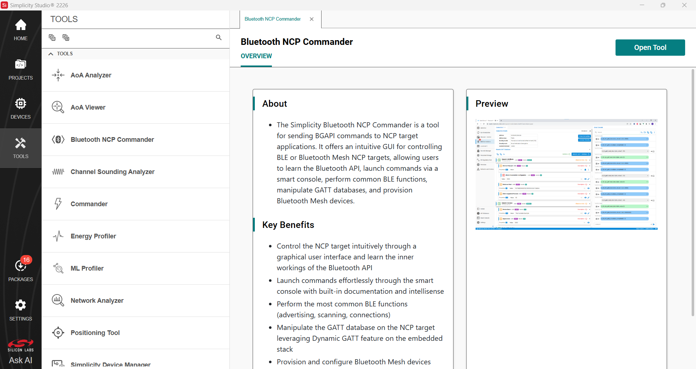
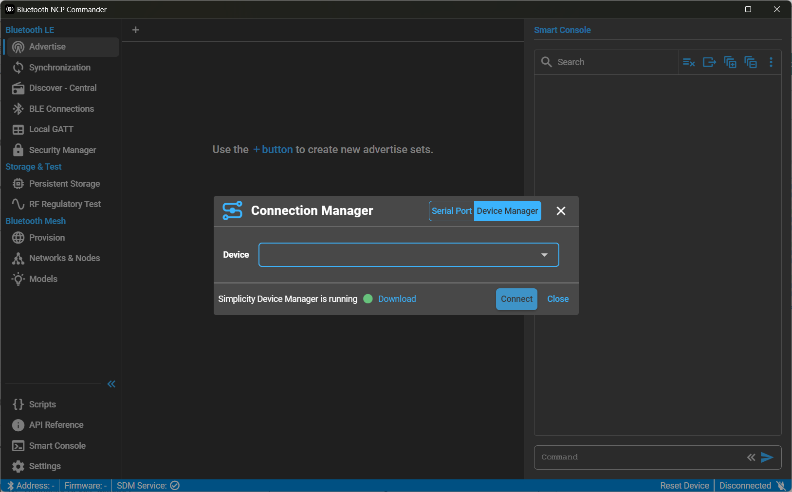
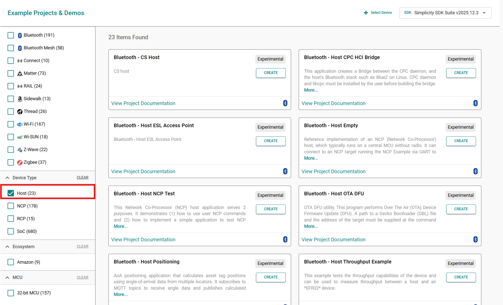
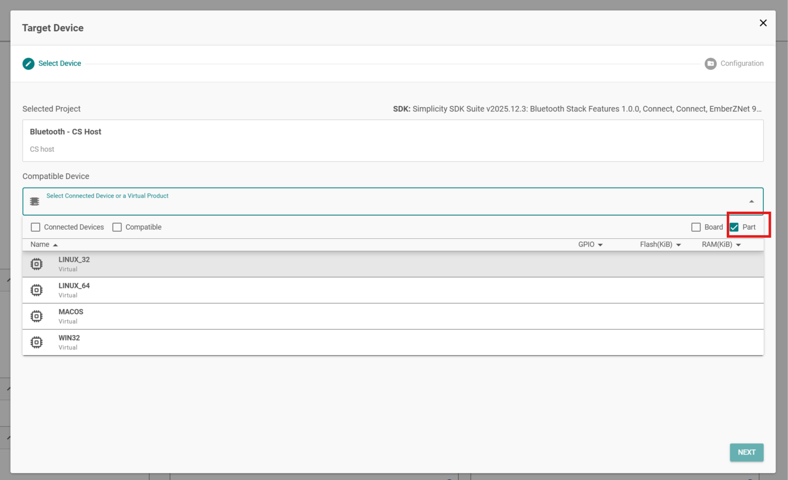

# NCP Host Development

This section introduces the Bluetooth NCP Commander tool, which can be used to send BGAPI commands from a graphical user interface. It then walks through the process of building the PC Host examples provided in the Bluetooth SDK. And finally, it describes using Python for host side development.

## Bluetooth NCP Commander

Bluetooth NCP Commander is an easy-to-use tool that can be used for testing different stack features, by sending BGAPI commands to the target device. The tool has two versions: a version built into Simplicity Studio, which makes it easy to connect to your development kit and start testing, and a standalone version to test a board in an environment where Simplicity Studio cannot be installed, or if you want to test a custom board that can be accessed on UART interface, but not through a Simplicity Studio supported debug adapter using VCOM.

### Built-in Version

1. To open the built-in Bluetooth NCP Commander, select **Tools** tab on the left side, browse **Bluetooth NCP Commander** and click **Open Tool**.



2. Select the target device, and click **Connect**.

   

### Standalone Version

1. To open the standalone tool, navigate to *C:\Users\\\<user>\\.silabs\slt\installs\archive\ncpcommander-vx.y.z*, and start NcpCommander.exe.

2. In the standalone tool, provide the UART interface settings, and then select the COM port on which the device can be accessed.

   

### Bluetooth NCP Commander Functions

The following procedure covers most NCP Commander functions.

1. After the device is connected, you should see the result of the ``sl_bt_system_get_identity_address`` command displayed in green:

   

2. Unlike SoC examples, the NCP demo does not have a built-in GATT database. It expects the host to build the GATT database using the dynamic GATT database BGAPI commands. To create a basic GATT database, select the Local GATT menu, and click **Create Basic GATT**. This triggers a series of BGAPI commands that will build a basic database. You can modify this GATT database as you want. You can also change the device name here by changing the value of the Device Name characteristic.

   

3. To extend the database with new services, characteristics, and descriptors, click **Add Service**. You can then add new characteristics for the service.

   

4. To read out the GATT database from the device, click **Local GATT Database**. The smart console also supports API calls for creating entries.

   

5. To start advertising your device so that other devices can discover it and connect to it, in the Advertise menu click '**+**' (Create Set) to create an advertiser set.

   

6. To populate the advertisement payload with the device name, set the Advertising Data Type to **Generated data** and click **Start** to start advertising.

   

7. When advertising, the NCP target example accepts Bluetooth connections. If you connect to the mainboard or with another central device (for example with your phone), you can see the events and commands on the log.

   

8. You can also issue commands manually. For example, you can issue the 'system hello' command at any time to verify that communication between the host and the device is working. The Smart Console provides auto-completion and documentation for the possible commands. To open/close the documentation, click the arrows at the right side of the input field.

   

9. To create periodic advertisement sets, select **Advertisement mode: Periodic**. To set the content of the packet, use the **Edit** option next to "Periodic Advertising Packets".

   

     This opens a new dialog where you can edit the contents of the package. Click **Set Data** after the data is edited.
  
     

10. It is also possible to synchronize to periodic advertisement trains. To do this, click **Synchronization** on the left menu, input the Advertiser Address and advertising Set identifier, and click **Open Synchronization**.

    

11. NCP Commander also provides a simple scripting feature. You can create or import an existing script with the controls on the top right corner. You can use any BGAPI commands in the script, but there are no additional features, such as branching or error handling.

    

     You can export the commands sent in the Smart console with the **Export** control. This saves the sent commands to a file that can be imported back as a script. You can also export the raw script using the **Export** button under the editor.

    

### Host Provisioner with Bluetooth NCP Commander

Bluetooth NCP Commander also supports Bluetooth mesh features. You can issue Bluetooth mesh commands manually in the command box of Smart Console or use the host provisioner feature from the left menu. You can use the feature to provision and configure mesh nodes and to manage mesh networks rather than using a Bluetooth Mesh mobile application.

To use the Bluetooth Mesh features, create, build, and flash the device with an NCP example supporting Mesh features. Otherwise, the provisioner initialization attempt returns SL_STATUS_NOT_SUPPORTED (0x000f).


In **Settings**, if the **Reset Mesh Node before Initializing as Provisioner** option is enabled, the host provisioner does a factory reset (the **node_reset** command) on the NCP target device before initializing the node. Clicking **Clear Data** next to **Remove all locally saved mesh data** removes the network and application keys that were configured during initialization.


1. To start using the host provisioner, select either **Provision** or **Networks & Nodes** on the left menu, and click **Initialize as Provisioner**.

    

2. To provision devices, select **Provision** on the left menu and click **Start Scan** in the right panel. The devices that are transmitting unprovisioned beacons are shown in the **Discovered Devices** section. If you do not have a network from a previous configuration or have reset the provisioner node, you must create a new network with **Create New Network**.

    

3. Enter the name of the new network and click **Confirm**.

    

4. Click **Provision** next to the device you want to provision.

    

5. Before configuring devices, you may need to create application keys and groups. Application keys, groups, and other network settings can be managed in the **Settings** tab of the **Networks & Nodes** menu item. To create an application key, click **Create App Key**, name the key, and click **Confirm**. You can create as many application keys as you need. If you have created any application keys before, you can click **Get App Keys** to retrieve them. To create a group, click **Add Group**, name the group, and click **Confirm**. You can create as many groups as you need.

    

6. In the same tab, you can induce a full network-wide key refresh or exclude nodes.

    

7. To configure a provisioned device, select **Networks & Nodes** on the left menu. The devices you provisioned are shown in the **Nodes (Provisioned Devices)** section of the **Settings** tab. Click **Configure** and a **Mesh Node** tab opens in which you can configure the device.

    

8. In the **Application Keys** section of the **Mesh Node** tab, select an application key from the drop-down list and then click **Add**.

    

9. Click **Get DCD** to configure all the Models available on your node(s), bind to app keys, set publishing or subscription to groups, fine tune parameters, and so on.

    

10. To configure the Provisioner, the Models must first be initialized using **Initialize Client Models**.

    

11. The Application Key must be bound to the Models in order for them to decrypt received messages. Press **Bind**.

    

12. To subscribe the Models to the messages of the recently created Group (optional), select the chosen Group from the dropdown and click **Subscribe**.

    

13. When configuration is complete, click **Done**. The **Show Nodes** tab is displayed, where you can **Get DCD** of the provisioned Node(s).

    

14. After listing, you can **Get** or **Set** the Server states of the Node(s).

    

15. Click Set to set the current state of the selected Server of the selected Node.

    

16. Click **Get** to get the current state of the selected Server of the selected Node.

    

17. On the **Show Groups** tab, you can **Set** or **Get** the Server Model(s) states on a Group level.

    

## Building the NCP Host Examples on Windows

Simplicity Studio SDK contains NCP Host example projects for PC. These examples can be compiled on Windows or any POSIX OS. This section goes through the build process on Windows.

>**Note**: The host example projects in the SDK use the dynamic GATT database feature. They are to be used with the **Bluetooth – NCP** target application.

1. To build the examples properly, the MSYS2 development toolchain must be installed on your PC. Download MSYS2 at [MSYS2](https://www.msys2.org/).

2. After MSYS2 is installed, update the package database as described at [MSYS2](https://www.msys2.org/).

3. Start MSYS2 bash and install mingw-64 with the following command:

    ```C
    pacman -S make mingw-w64-x86_64-gcc
    ```

4. Close MSYS2 and start MSYS2 MinGW 64-bit.

    

5. Create a new **Bluetooth - Host Empty** project in Simplicity Studio 6

    
    
6. At the Target Device select the option **Part** and **WIN32**
    

7. Navigate to the project folder in MSYS2 MinGW 64-bit.

8. Build the project in MSYS2 MinGW 64-bit
    ```C
    make -f bt_host_empty.Makefile
    ```
9. The build output is created in a new *build/debug/* folder. Navigate to this folder, and then run`bt_host_empty.exe` with the interface as an argument.

10. Once the UART connection with the device is established, the following should appear:

``` 
    MINGW64 ~/SimplicityStudio/v6_workspace_2226/bt_host_empty
    $ ./build/debug/bt_host_empty.exe -u COM30
    [D] Timer function intialized
    [I] NCP host initialised.
    [I] Press Crtl+C to quit

    [I] Rebooting NCP target (0)...
    [I] Bluetooth stack booted: v11.0.1+0e13429e
    [I] Bluetooth public device address: 04:87:27:E7:07:5D
    [I] Started advertising.
```
10. The device advertises and ready for Bluetooth connection.

## Using Python for Host Side Development

You can also implement a host application using Python. A Python package is available at [PyBGAPI](https://pypi.org/project/pybgapi/). This package parses the API description file of the Bluetooth SDK and makes it possible to issue BGAPI commands and get BGAPI events in the Python environment. See the referred website for further documentation.
