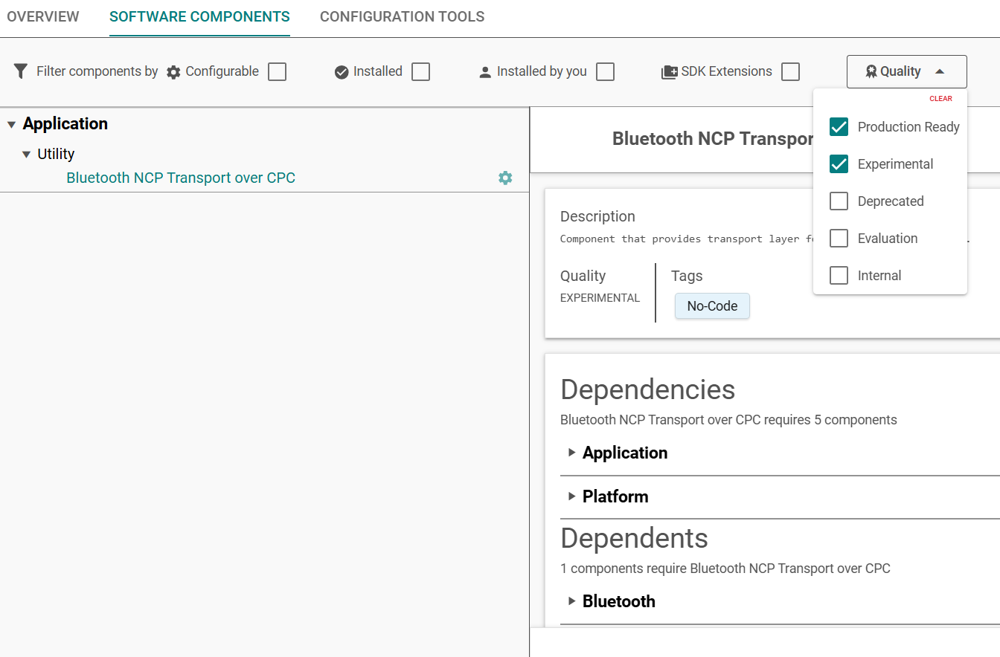
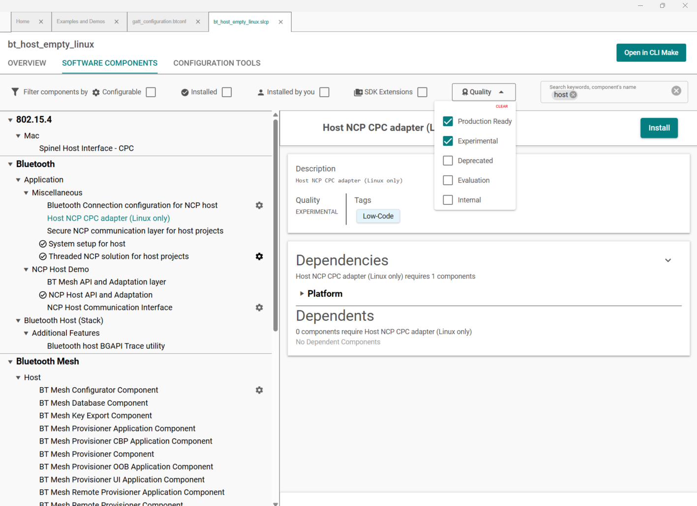

# Using NCP with CPC (Co-Processor Communication)

## Co-Processor Communication Overview

The purpose of the Co-Processor Communication (CPC) Protocol is to act as a serial link multiplexer that allows data sent from multiple applications to be transported over a secure shared physical link. In CPC, data transfers between processors are segmented in sequential packets over endpoints. Transfers are guaranteed to be error-free and sent in order.

Find more information about the CPC at [https://docs.silabs.com/gecko-platform/latest/platform-cpc-overview/](https://docs.silabs.com/gecko-platform/latest/platform-cpc-overview/).

## Usage

The CPC daemon acts as a bridge between the host and the target application. It was designed to make a reliable connection between two ends through UART or SPI. Reliability is achieved by an HDLC-like header and CPC. It offers multi-channel communication, and security is turned on by default. It is a connection-based protocol, so that if a message arrives incorrectly, it notifies the other end, which then can re-send that message.


The NCP host by default does not contain usage of CPC. You need to build the application with **Host NCP CPC adapter (Linux only)** component.

>**Note**: The Host NCP CPC adapter (Linux only) component is Experimental currently. 

## Use Cases

Adding the CPC functionality is recommended for the following use cases, as they cannot be used with the simple UART interface:

- Using SPI as the transport layer: SPI communication is only supported with CPC.

- DMP projects: the CPC protocol contains a multiplexer, which makes it possible to use the same interface for different applications.

## Building the Target

To make the target use CPC communication, replace the USART component in the **bt_ncp** sample application with **CPC Secondary - UART (USART)** or **CPC Secondary – SPI (USART)**. This adds the necessary components to enable CPC communication on the target. Set the pins of the selected communication interface according to the hardware design of the project.

In NCP setup **Bluetooth NCP Transport over CPC** component is required.

>**Note**: The Bluetooth NCP Transport over CPC component is Experimental currently. 
    


The encryption of the communication is enabled by default. For developing and debugging, Silicon Labs recommends adding the **CPC SECURITY NONE** component so that the packet traces can be easier analyzed.


## Host Side

Perform the following steps:

### Step 1: Build the CPC daemon

Download the code for the CPC daemon and follow the instructions to build it from [https://github.com/SiliconLabs/cpc-daemon](https://github.com/SiliconLabs/cpc-daemon).

After the build is finished, open the *cpcd.conf* file and set the **bus_type**, and configure the pins and bitrate according to the settings on the Secondary side.

If the **CPC SECURITY NONE** component was added to the target, set **disable_encryption** to true.

### Step 2: Build the host application

1. Create a new **Bluetooth - Host empty** project in Simplicity Studio 6
    

2. At the *Target Device* select the option *Part* and *Linux*
    

3. Add *Host NCP CPC adapter (Linux only)* component
    
>**Note**: The Host NCP CPC adapter (Linux only) component is Experimental currently. 
4. Build the project
    ```C
    make -f bt_host_empty.Makefile
    ```
5. The build output is created in a new *build/debug/* folder.

### Step 3: Run the application

Start the CPC daemon `cpcd -c ./cpcd.conf`.

Start the host application by passing the **instance_name** set in the *cpcd.conf* file: `./bt_host_empty -C cpcd_0`.
