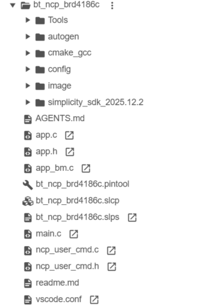
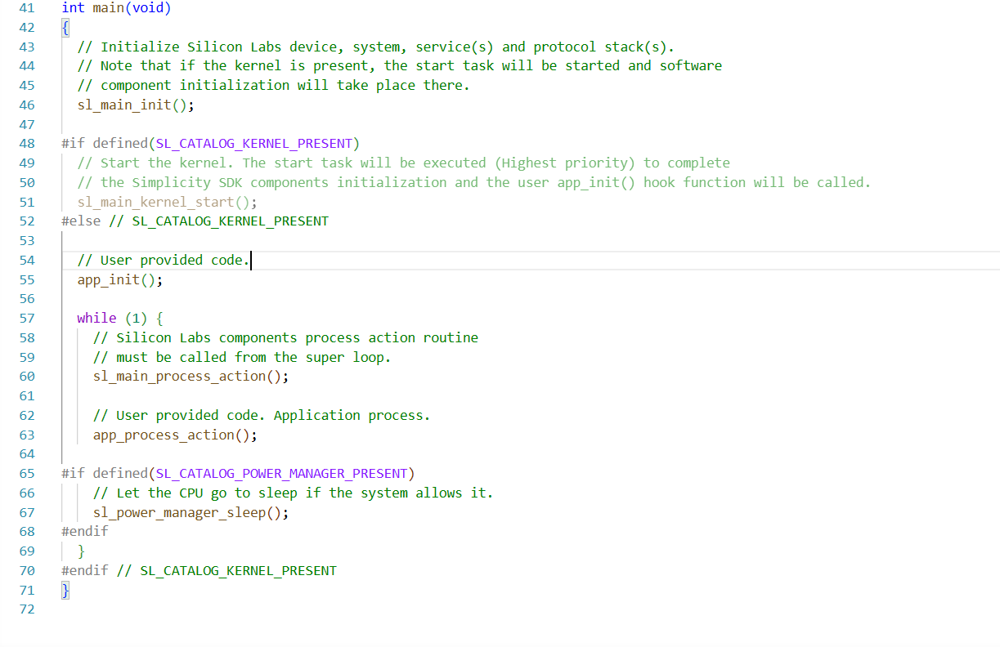

# Example Project Walkthrough

This page describes the structure of the example NCP Host and Target projects, and highlights the parts that can be important if you create your own project.

## NCP Target

This section focuses on the NCP-specific part of the **Bluetooth - NCP** SSv6 project. You can find a general project description in [Silicon Labs Bluetooth C Application Developers Guide](https://docs.silabs.com/bluetooth/latest/bluetooth-c-soc-dev-guide-sdk-v9x/).

The **Bluetooth - NCP** example does not contain a GATT database. The dynamic GATT API can be used for building it. This is recommended because the target code does not need to be modified and synchronized with the Host code when the GATT database is updated.

### Project File Structure

A common directory and file structure are used across the examples in the Bluetooth SDK. The following figure shows this layout.



These files and directories are present in the root directory of the project:

- *main.c* and *app.c/h* – the C application code

- *bt_ncp.pintool* – the hardware configuration file and user interface

- *bt_ncp.slcp* – the component configuration and user interface

- *bt_ncp.slps* – the project properties XML file

- *simplicity_sdk_.\<X.Y>* – the Bluetooth SDK source code

- *config* – the C configuration files of the hardware and Bluetooth stack. This directory contains the output files of the Pin Tool and Component Manager.

- *autogen* – the C configuration code of the application. This directory typically contains the stack definition and initialization C files, as well as the generated GATT database C declaration files (*gatt_db.c/h*).

### Pin Tool

1. Open the pin configuration tool (Pin Tool) on the project Configuration Tools tab.

   

   You can also double-click the *\<projectname>.pintool* file in the Project Explorer view, shown highlighted in the figure above.

2. Use this tool to modify the pin configuration of the device, for example, you can reassign the pins used for USART communication to the appropriate layout for a custom board design. You do this by selecting the desired pin in the list and then selecting its functionality from the drop-down list.

   

3. After clicking the selected item, the layout is updated. After saving the file, the configuration source codes are automatically generated.

   

### Project Configurator/Component Editor

You can install or uninstall components using the Project Configurator's Software Components tab. You can also configure installed components using the Component Editor. The following figures show how to change the NCP interface buffer sizes.

1. Select the component from the list and click **Configure**.

    

2. The Component Editor opens in a new tab with the possible configuration options. You can view the corresponding source code by clicking **Open Source**.

    

3. Apart from the application-specific NCP options, you can use the Project Configurator to configure the Bluetooth stack features that will be included in your project. Some advanced features are excluded from the stack by default, to save flash and memory. You can add the needed features, for example, the Adaptive Frequency Hopping (AFH) component, by clicking **Install**.

    

4. In many cases, you also need to change the default Bluetooth Core configuration, for example to enable more than four connections. To do so, browse for the Bluetooth Core component, and click **Configure**.

    

### Enabling Hardware Flow Control

In the sample applications, Hardware Flow Control is enabled by default. On the mainboard, hardware flow control can be enabled as described in this section.

Important: If the hardware flow control settings are not the same in the SoC and mainboard, the NCP will not work.

1. Open Simplicity Studio and, in the Debug Adapters view, right-click the target device.

2. Select **Connect**.

3. Right-click the device again and select **Launch Console**.

4. Select the admin tab.

5. Set flow control with the following command:

    ```C
    WSTK> serial vcom config handshake rtscts
    RTS handshake enabled
    CTS handshake enabled
    Serial configuration saved
    ```

6. Check the configuration with the following command:

    ```C
    WSTK> serial vcom
    ----- Virtual COM port -----
    Stored port speed : 115200
    Active port speed : 115226
    Stored handshake : rtscts
    Actual handshake : rtscts
    RTS Asserted - Ready to Receive.
    ```

The flow can be disabled by setting the handshake parameter to `none` in step 5 above.

### Main Walkthrough

This is a code snippet that corresponds to the `main` function. Because the Bluetooth stack and subsequent hardware are considered to be components, they are separated from the application processing that is entirely managed in *app.c/h*.



Once the USART and Bluetooth stack are initialized, the main loop continuously calls the component as well as the application state machine. The corresponding functions are `sl_main_process_action()` and `app_process_action()` respectively.

The `sl_main_process_action()` handles Silicon Labs tasks and routines. It must *not be removed* from the loop.

The default USART settings are mentioned in the Host example section. Make sure that the target and the host use the same configuration. The configuration can be adapted with the help of the Pin Tool and the Project Configurator.

### Application Callback and Actions

Use the `app_init()` function to call application-related initializations.

Use the `app_process_action()` function to call application-specific tasks and routines.


### NCP Code Walkthrough

The USART communication handling is implemented in *ncp_usart.c*. Receiving any command from the Host generates an interrupt, and it will queue the received data in the command queue. Similarly, when a stack generates an event, it will be put into an event queue, which will be forwarded to the Host. These two queues will be processed in *ncp.c*, as described on the following figure.


### Sleep Modes

The NCP example project does not enable deep sleep mode (EM2) by default, because UART needs EM1 or EM0 to be able to receive commands at any time. Deep sleep mode can be enabled, but in this case, it is essential to configure a wakeup pin so that the NCP Host can wake up the target before sending any BGAPI commands to it. Any available GPIO pin can be configured as a wakeup pin and the polarity is configurable. The following example shows how to configure pin PF6 as the wakeup pin using active-high polarity.

To enable deep sleep mode, the UARTDRV Core component's **Enable reception when sleeping** parameter must be disabled. Otherwise the UART driver will prevent the device from going into EM2 (deep sleep) and it will stay in EM1 (sleep):


To define a wakeup pin, the Bluetooth > Utility > Wake Lock component must be added to the project:


Configure the Wake-Lock component as follows:

- Enable the wake-lock (direction in) functionality

- Set the polarity (active high in this case)

- Assign the GPIO pin (PF6 in this example)

   

When the Host sets the wakeup pin to the configured active value, the NCP device will wake up from deep sleep and send out the event `sl_bt_evt_system_awake` to indicate to the host that it has woken up. The host must wait for this event before sending any BGAPI commands, otherwise they might be partially or completely missed.

The remote wake-lock (direction: out) functionality can be used to wake up the host before the NCP target sends out an event. This way the host is also able to go into sleep mode, and it will be notified when it should wake up.

## PC Host

The PC host application project that comes with the SDK is written in C. The host-side source files for this project are copied / linked after a host project is generated from Simplicity Studio 6.

The projects comprise only a few source and header files. Note, however, that many other files are referenced from the SDK in the makefile.
For further details about the host side application please refer to [Host Side build](./04-secure-ncp.md#host-side).

### BGAPI Support Files

While the files in the previous section contain all of the application logic, the actual BGLib implementation code containing the BGAPI parser and packet generation functions is found elsewhere, in other subfolders.

Default location for SiSDK 2025.12.x and above:

- `C:\Users\<NAME>\.silabs\slt\installs\conan\p\<SDK identifier>\p\protocol\bluetooth\inc\sl_bt_ncp_host.h`

- `C:\Users\<NAME>\.silabs\slt\installs\conan\p\<SDK identifier>\p\protocol\bluetooth\src\sl_bt_ncp_host.c`

- `C:\Users\<NAME>\.silabs\slt\installs\conan\p\<SDK identifier>\p\protocol\bluetooth\src\sl_bt_ncp_host_api.c`

The SDK’s specific arrangement of files is one possible way the BGAPI protocol can be used, but it is also possible to create your own library code that implements the protocol correctly with a different code architecture. The only requirement here is that the chosen implementation must be able to create BGAPI command packets correctly and send them to the module over UART. Similarly, it must be able to receive BGAPI response and event packets over UART and process them into whatever function calls are needed to trigger the desired application behavior.

The header files contain primarily #define’d compiler macros and named constants that correspond to all of the various API methods and enumerations you may need to use. The *sl_bt_ncp_host.h* file also contains function declarations for the basic packet reception, processing, and transmission functions.

The *sl_bt_ncp_host.c* file contains the implementation of the packet management functions. All functions defined here use only ANSI C code, to help ensure maximum cross-compatibility on different platforms.

>**Note**: With structure packing, the SDK’s BGLib implementation makes heavy use of direct mapping of packet payload structures onto contiguous blocks of memory, to avoid additional parsing and RAM usage. This is accomplished with the PACKSTRUCT macro used extensively in the BGLib header files. It is important to ensure than any ported version of BGLib also correctly packs structures together (no padding on multi-byte struct member variables) in order to achieve the correct operation.

 With byte order, the BGAPI protocol uses little-endian byte ordering for all multi-byte integer values, which means directly-mapped structures will only work if the host platform also uses little-endian byte ordering. This covers most common platforms today, but some big-endian platforms exist and are actively used today (Motorola 6800, 68k, and so on).

### Host Application Logic

1. Initialize BGLIB.

   ```C
   sl_bt_api_initialize_nonblock(ncp_host_tx, ncp_host_rx, ncp_host_lazy_peek);
   ```

2. Initialize UART.

    ```C
    handle_ptr = &handle;
    HOST_COMM_API_INITIALIZE_NONBLOCK(uartTx, uartRx, uartRxPeek);
    status = uartOpen(handle_ptr, (int8_t *)uart_port, uart_baud_rate,
                      uart_flow_control, DEFAULT_UART_TIMEOUT);
    if (status < HANDLE_VALUE_MIN) {
      app_log_error("Failed to open serial connection (%d)"
                    APP_LOG_NL, status);
      exit(EXIT_FAILURE);
    }
    uartFlush(handle_ptr);
    ```

3. Reset NCP Target to ensure it gets into a defined state. Once the chip successfully boots, the `sl_bt_evt_system_boot_id` event should be received.

      ```C
      // This command is equivalent with sl_bt_system_reboot
    uint8_t reboot_command[] = { 0x20, 0x00, 0x01, 0x1f };

    if (boot_retry_count < NCP_REBOOT_RETRY_COUNT) {
      app_log_info("Rebooting NCP target (%d)..." APP_LOG_NL, boot_retry_count);
      boot_retry_count++;
      (void)host_comm_tx(sizeof(reboot_command), reboot_command);
      sl_status_t sc = app_timer_start(timer,
                                      NCP_REBOOT_TIMEOUT_RETRY_MS,
                                      on_boot_timer_expire,
                                      NULL,
                                      false);
      app_assert_status(sc);
    } else {
      app_assert(false, "NCP target unreachable.");
    }
      ```

4. The `sl_bt_step` function will be called from the main loop.  It checks for any NCP Target events and forwards them to the handler function.

    ```C
    // Poll Bluetooth stack for an event and call event handler
    void sl_bt_step(void)
    {
    sl_bt_msg_t evt;

    // Run the Bluetooth host stack processing step
    sl_bt_run();

    // Check the length of the next event, if any, and verify that the application
    // can process it. To prevent data loss, the event will be kept in the stack's
    // queue if the application cannot process it at the moment.
    size_t event_len = sli_bgapi_device_peek_event_len(&sli_bt_bgapi_device);
    if ((event_len == 0) || (!sl_bt_can_process_event(event_len))) {
      return;
    } 
    ```

5. Process the incoming NCP target events.

    ```C
    /**************************************************************************//**
    * Bluetooth stack event handler.
    * This overrides the default weak implementation.
    *
    * @param[in] evt Event coming from the Bluetooth stack.
    *****************************************************************************/
    void sl_bt_on_event(sl_bt_msg_t *evt)
    {
      sl_status_t sc;
      bd_addr address;
      uint8_t address_type;
      uint8_t system_id[8];

      switch (SL_BT_MSG_ID(evt->header)) {
        // -------------------------------
        // This event indicates the device has started and the radio is ready.
        // Do not call any stack command before receiving this boot event!
        case sl_bt_evt_system_boot_id:
          // Extract unique ID from BT Address.
          sc = sl_bt_gap_get_identity_address(&address, &address_type);
          app_assert_status(sc);
          app_log_info("Bluetooth %s address: %02X:%02X:%02X:%02X:%02X:%02X" APP_LOG_NL,
                      address_type ? "static random" : "public device",
                      address.addr[5],
                      address.addr[4],
                      address.addr[3],
                      address.addr[2],
                      address.addr[1],
                      address.addr[0]);

          // Pad and reverse unique ID to get System ID.
          system_id[0] = address.addr[5];
          system_id[1] = address.addr[4];
          system_id[2] = address.addr[3];
          system_id[3] = 0xFF;
          system_id[4] = 0xFE;
          system_id[5] = address.addr[2];
          system_id[6] = address.addr[1];
          system_id[7] = address.addr[0];

          sc = sl_bt_gatt_server_write_attribute_value(gattdb_system_id,
                                                      0,
                                                      sizeof(system_id),
                                                      system_id);
          app_assert_status(sc);

          // Create an advertising set.
          sc = sl_bt_advertiser_create_set(&advertising_set_handle);
          app_assert_status(sc);

          // Generate data for advertising
          sc = sl_bt_legacy_advertiser_generate_data(advertising_set_handle,
                                                    sl_bt_advertiser_general_discoverable);
          app_assert(sc == SL_STATUS_OK,
                    "[E: 0x%04x] Failed to generate advertising data\n",
                    (int)sc);

          // Set advertising interval to 100ms.
          sc = sl_bt_advertiser_set_timing(
            advertising_set_handle,
            160, // min. adv. interval (milliseconds * 1.6)
            160, // max. adv. interval (milliseconds * 1.6)
            0,   // adv. duration
            0);  // max. num. adv. events
          app_assert_status(sc);
          // Start general advertising and enable connections.
          sc = sl_bt_legacy_advertiser_start(advertising_set_handle,
                                            sl_bt_legacy_advertiser_connectable);
          app_assert_status(sc);
          app_log_info("Started advertising." APP_LOG_NL);
          break;

        // -------------------------------
        // This event indicates that a new connection was opened.
        case sl_bt_evt_connection_opened_id:
          app_log_info("Connection opened." APP_LOG_NL);
          break;

        // -------------------------------
        // This event indicates that a connection was closed.
        case sl_bt_evt_connection_closed_id:
          app_log_info("Connection closed." APP_LOG_NL);

          // Generate data for advertising
          sc = sl_bt_legacy_advertiser_generate_data(advertising_set_handle,
                                                    sl_bt_advertiser_general_discoverable);
          app_assert(sc == SL_STATUS_OK,
                    "[E: 0x%04x] Failed to generate advertising data\n",
                    (int)sc);

          // Restart advertising after client has disconnected.
          sc = sl_bt_legacy_advertiser_start(advertising_set_handle,
                                            sl_bt_legacy_advertiser_connectable);
          app_assert_status(sc);
          app_log_info("Started advertising." APP_LOG_NL);
          break;

        ///////////////////////////////////////////////////////////////////////////
        // Add additional event handlers here as your application requires!      //
        ///////////////////////////////////////////////////////////////////////////

        // -------------------------------
        // Default event handler.
        default:
          break;
      }
    }
    ```
